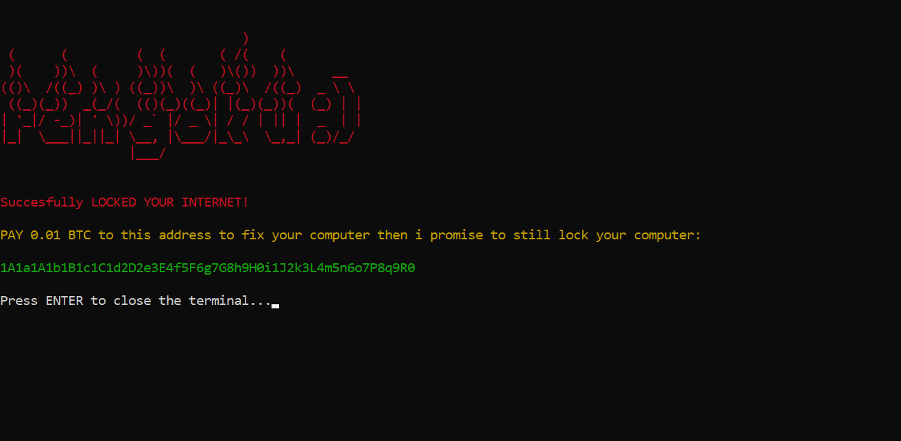

# 🔒 Network-Ransomware (Wi-Fi Lock Prank)

This tool is used to demonstrate ransomware in a safe way (I have tried it on my own computer).  
Instead of locking files, it will lock the internet.  

`unlock.exe` will act as a decryption tool to unlock the internet.  

It can also be used as a joke prank.

---

## ⚠️ Disclaimer

**I’m not responsible for any unethical use.**  
Please do **not** upload this to VirusTotal. I’ve worked hard to make it undetectable by Windows Defender.
